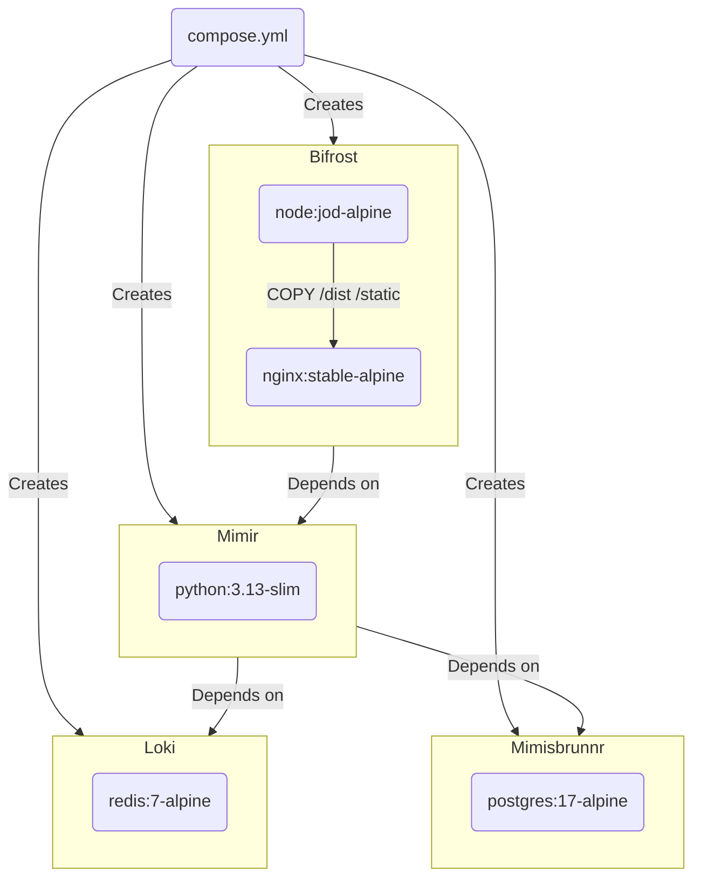
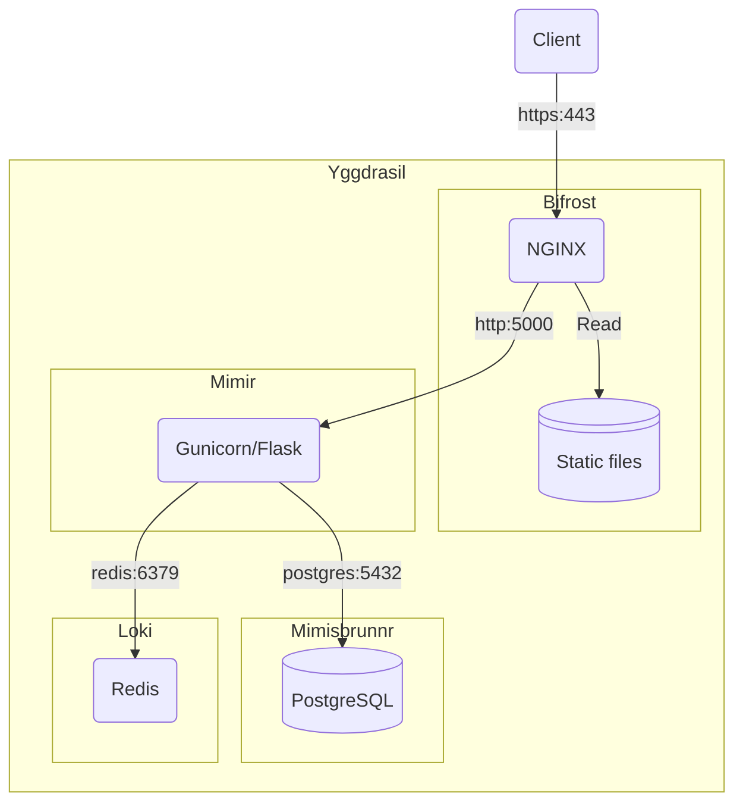
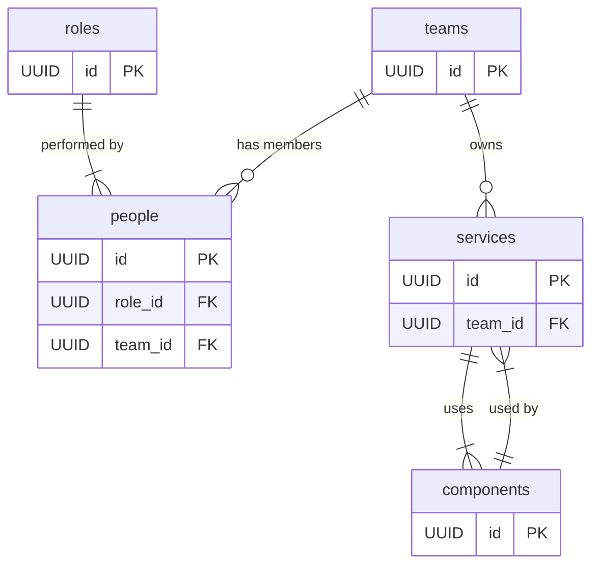

# Mímir

Mímir is a service directory and organisational knowledge base. It helps teams and leadership to understand who is responsible for what, how systems are connected, and what parts of the architecture depend on others.

Mímir is named after the wise being from Norse mythology, who guarded a well of deep knowledge and counsel beneath the world tree. This project honours that mythos by offering a system to map and manage organisational knowledge — especially the relationships between people, teams, services, and the components they rely on.

## Features

- **Ownership mapping** — “Who owns this service?”

  Track accountability across teams and services.

- **Team composition tracking** — “Who’s in this team, and what do they do?”

  Understand team makeup and role distribution.

- **Dependency analysis** — “Which components are shared across services?”

  Reveal architectural reuse and potential points of failure.

- **Role-based insights** — “Who are the developers working on critical services?”

  Filter by responsibility and capability across the estate.

- **Change impact assessment** — “If we change this component, who needs to know?”

  Anticipate downstream effects before making architectural changes.

## Requirements

- Docker

## Getting started

### Set local environment variables

Create a `.env` file in the root of the repo and enter your specific config based on this example:

```dotenv
GRADES=AA,AO,EO,HEO,SEO,G7,G6
POSTGRES_DB=mimisbrunnr
POSTGRES_HOST=mimisbrunnr
POSTGRES_PASSWORD=smartestmanalive
POSTGRES_PORT=5432
POSTGRES_USER=mimir
REDIS_HOST=loki
REDIS_PORT=6379
SECRET_KEY=<see_below>
```

You **must** set a new `SECRET_KEY`, which is used to securely sign the session cookie and CSRF tokens. It should be a long random `bytes` or `str`. You can use the output of this Python command to generate a new key:

```shell
python -c 'import secrets; print(secrets.token_hex())'
```

### Run containers

```shell
docker compose up --watch
```

You should now have the app running on <https://localhost/>. Accept the browsers security warning due to the self-signed HTTPS certificate to continue.

## Testing

To run the tests:

```shell
python -m pytest --cov=app --cov-report=term-missing --cov-branch
```

## Build process

This project uses Docker Compose to provision containers:



## Architecture overview



Each component in the architecture is named after a figure or element in Norse mythology. These names were chosen to reflect the function and behavior of the service they represent:

### Bifrost

NGINX Reverse Proxy and Static File Server

> “The burning rainbow bridge that connects Midgard (the realm of humans) to Asgard (the realm of the gods).”

- **What:** Acts as the secure HTTPS entry point to the system. It terminates TLS, routes requests to the backend (Mímir), and serves static files such as the frontend app and assets.
- **Why:** Separating static and dynamic routing at the proxy layer ensures performance, security, and scalability. NGINX is fast, battle-tested, and easily configurable.
- **Mythology:** Just as Bifrost connects realms, this component connects users to the application ecosystem.

### Mímir

Flask + Gunicorn application server

> “A wise being who guards Mimisbrunnr, the well of wisdom. Even after death, Mímir’s severed head continues to give advice to Odin.”

- **What:** Hosts the business logic and REST API. It processes client requests, talks to the database (Mimisbrunnr), and uses the cache (Loki) to optimize performance.
- **Why:** Flask offers flexibility and simplicity, while Gunicorn handles concurrency. This separation of concerns allows clean, testable architecture.
- **Mythology:** Like the wise Mímir, this service is the thinking core of the application—it holds and exposes the logic of the system.

### Mimisbrunnr

PostgreSQL Database

> “The Well of Wisdom beneath Yggdrasil’s roots. Odin sacrificed an eye to drink from it and gain deep knowledge.”

- **What:** Stores all persistent data in a normalised, relational model.
- **Why:** PostgreSQL is reliable, supports rich querying, and integrates well with Flask via ORMs or SQLAlchemy. Using a relational DB supports integrity and consistency in the data model.
- **Mythology:** As the well of knowledge, Mimisbrunnr is the source of all truths the application relies on.

### Loki

Redis Cache

> “The trickster god, known for speed, mischief, and unpredictability. Often at the center of both chaos and transformation.”

- **What:** Provides fast, in-memory storage for ephemeral data—used for caching, temporary tokens, session data, etc.
- **Why:** Redis is extremely fast and well-suited for performance-critical features. It decouples the persistence layer from volatile needs.
- **Mythology:** Like the unpredictable Loki, this component is fast, transient, and sometimes mischievous—but indispensable.

### Yggdrasil

Docker Compose Network

> “The World Tree, connecting the nine realms of Norse cosmology. A living system that sustains all worlds.”

- **What:** Defines the network within which all containers communicate securely and predictably.
- **Why:** Docker Compose simplifies multi-service orchestration and local development. Networking them under yggdrasil makes component communication seamless.
- **Mythology:** Yggdrasil binds all services together, enabling the flow of data and control—just as it connects the nine realms.

## Logical data model



Mímir models the interconnected domains of digital organisations with five key concepts:

- **People** — individuals with a specific role, assigned to a team
- **Teams** — groups of people responsible for services
- **Roles** — responsibilities individuals hold
- **Services** — digital systems owned by teams
- **Components** — shared or standalone technical building blocks
