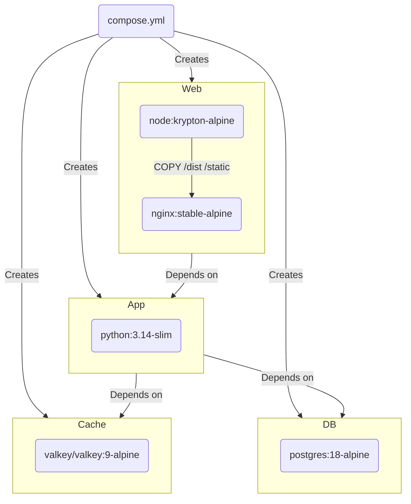
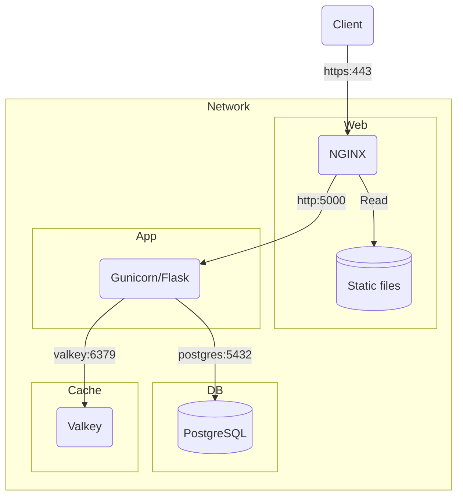
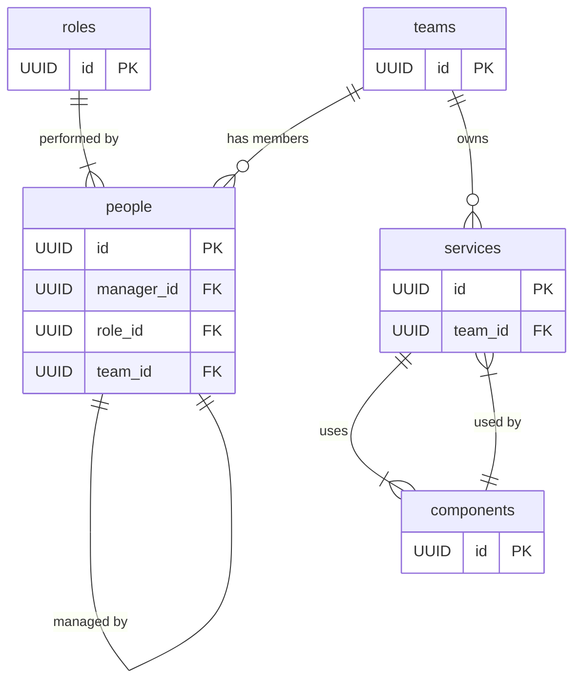

# Conflux

Conflux is an organisational knowledge platform that helps teams understand ownership, responsibilities, and dependencies across people, teams, services, and components. It provides a clear, up-to-date view of how work is structured and how changes propagate through the organisation, enabling better decision-making and safer change.

## Features

- **Ownership mapping** — _"Who owns this service?"_ Track accountability across teams and services.
- **Team composition tracking** — _"Who’s in this team, and what do they do?"_ Understand team makeup and role distribution.
- **Dependency analysis** — _"Which components are shared across services?"_ Reveal architectural reuse and potential points of failure.
- **Role-based insights** — _"Who are the developers working on critical services?"_ Filter by responsibility and capability across the estate.
- **Change impact assessment** — _"If we change this component, who needs to know?"_ Anticipate downstream effects before making architectural changes.

## Requirements

- Docker

## Getting started

### Set local environment variables

Create a `.env` file in the root of the repo and enter your specific config based on this example:

```dotenv
GRADES=AA,AO,EO,HEO,SEO,SEO+,G7,G6
LOCATIONS=Birkenhead,Coventry,Croydon,Durham,Fylde,Gloucester,Hull,Leicester,Nottingham,Peterborough,Plymouth,Swansea,Telford,Weymouth
POSTGRES_DB=mimisbrunnr
POSTGRES_HOST=db
POSTGRES_PASSWORD=smartestmanalive
POSTGRES_PORT=5432
POSTGRES_USER=mimir
VALKEY_HOST=cache
VALKEY_PORT=6379
SECRET_KEY=<see_below>
```

You **must** set a new `SECRET_KEY`, which is used to securely sign the session cookie and CSRF tokens. It should be a long random `bytes` or `str`. You can use the output of this Python command to generate a new key:

```shell
python -c 'import secrets; print(secrets.token_hex())'
```

### Run containers

```shell
docker compose up --watch
```

You should now have the app running on <https://localhost/>. Accept the browsers security warning due to the self-signed HTTPS certificate to continue.

## Testing

To run the tests:

```shell
python -m pytest --cov=app --cov-report=term-missing --cov-branch
```

## Build process

This project uses Docker Compose to provision containers:



## Architecture overview



### Web

NGINX Reverse Proxy and Static File Server

- **What:** Acts as the secure HTTPS entry point to the system. It terminates TLS, routes requests to the backend, and serves static files such as the frontend assets.
- **Why:** Separating static and dynamic routing at the proxy layer ensures performance, security, and scalability. NGINX is fast, battle-tested, and easily configurable.

### App

Flask + Gunicorn application server

- **What:** Hosts the business logic and REST API. It processes client requests, talks to the database, and uses the cache to optimise performance.
- **Why:** Flask offers flexibility and simplicity, while Gunicorn handles concurrency. This separation of concerns allows clean, testable architecture.

### DB

PostgreSQL Database

- **What:** Stores all persistent data in a normalised, relational model.
- **Why:** PostgreSQL is reliable, supports rich querying, and integrates well with Flask via ORMs or SQLAlchemy. Using a relational DB supports integrity and consistency in the data model.

### Cache

Valkey Cache

- **What:** Provides fast, in-memory storage for ephemeral data—used for caching, temporary tokens, session data, etc.
- **Why:** Valkey is extremely fast and well-suited for performance-critical features. It decouples the persistence layer from volatile needs.

### Network

Docker Compose Network

- **What:** Defines the network within which all containers communicate securely and predictably.
- **Why:** Docker Compose simplifies multi-service orchestration and local development.

## Logical data model



Conflux models the interconnected domains of digital organisations with five key concepts:

- **People** — individuals with a specific role, assigned to a team
- **Teams** — groups of people responsible for services
- **Roles** — responsibilities individuals hold
- **Services** — digital systems owned by teams
- **Components** — shared or standalone technical building blocks
