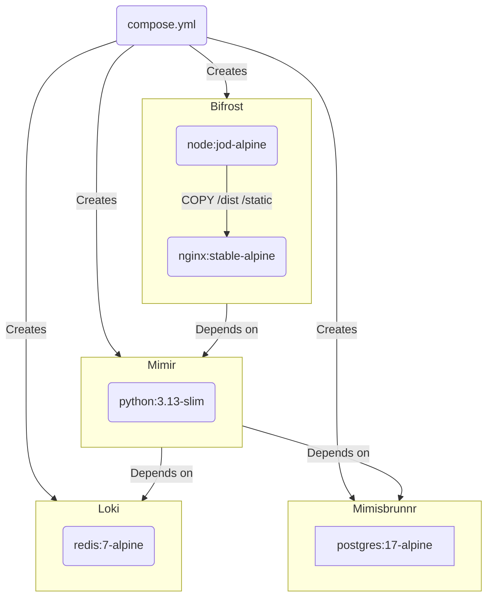
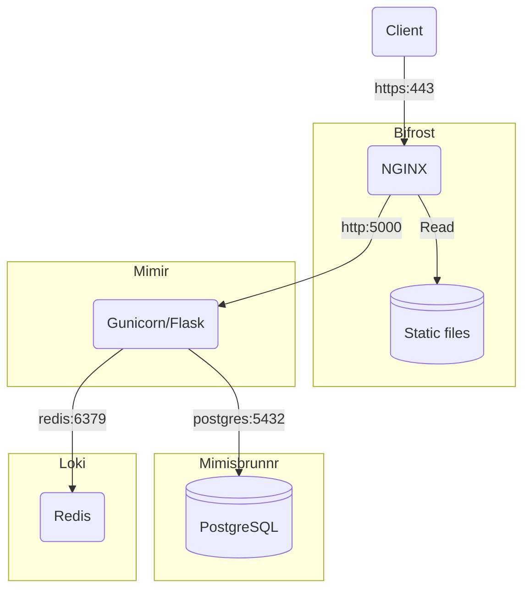

# Mímir


## Requirements

- Docker

## Getting started

### Set local environment variables

Create a `.env` file in the root of the repo. Enter your specific service information for the following:

```dotenv
CONTACT_EMAIL=[contact email]
CONTACT_PHONE=[contact phone]
DEPARTMENT_NAME=[name of department]
DEPARTMENT_URL=[url of department]
POSTGRES_DB=db_name
POSTGRES_PASSWORD=db_password
POSTGRES_USER=db_user
REDIS_URL=redis://loki:6379
SECRET_KEY=
SERVICE_NAME=[name of service]
SERVICE_PHASE=[phase]
SERVICE_URL=[url of service]
```

You **must** set a new `SECRET_KEY`, which is used to securely sign the session cookie and CSRF tokens. It should be a long random `bytes` or `str`. You can use the output of this Python command to generate a new key:

```shell
python -c 'import secrets; print(secrets.token_hex())'
```

### Run containers

```shell
docker compose up --build --watch
```

You should now have the app running on <https://localhost/>. Accept the browsers security warning due to the self-signed HTTPS certificate to continue.

## Testing

To run the tests:

```shell
python -m pytest --cov=app --cov-report=term-missing --cov-branch
```

## Build



## Environment


