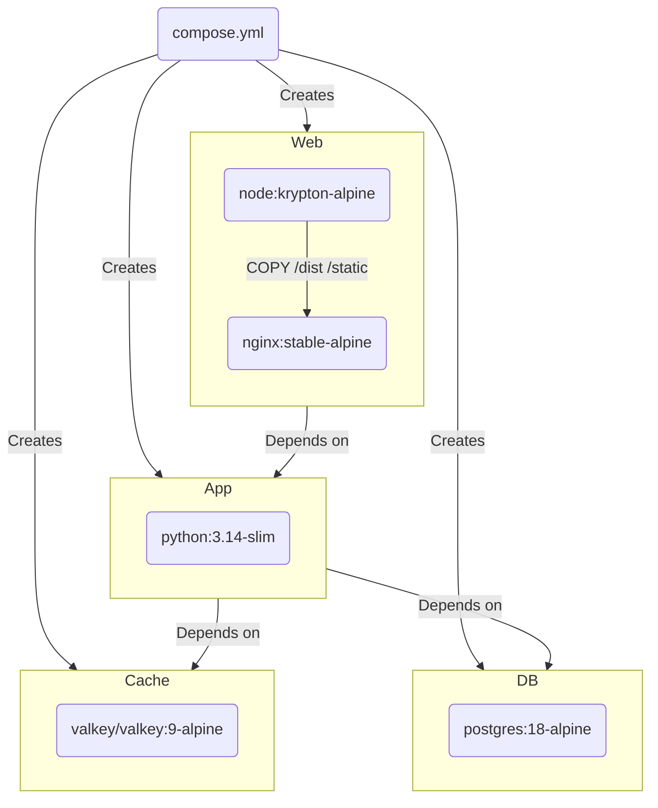
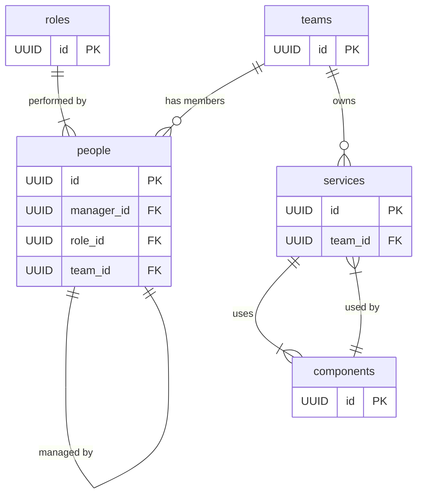

# Conflux

Conflux is an operational knowledge platform that helps organisations understand ownership, responsibility, and dependency across people, teams, services, and components.

As organisations grow, ownership and dependency information often becomes fragmented across spreadsheets, wiki pages, diagrams, ticketing systems, and tribal knowledge.

Over time this leads to:

- unclear ownership
- unsupported services
- duplicated capability
- risky change
- coordination overhead
- operational blind spots

Conflux provides a continuously maintained view of how technology capabilities are organised, who is accountable for them, and how technical dependencies connect the wider estate. Conflux helps teams make safer changes, reduce operational risk, and improve organisational visibility by bringing together organisational structure and technical architecture into a single coherent model.

## Core concepts

Conflux models technology organisations through five connected concepts.

### People

**An individual within the organisation.**

Each person belongs to a team and performs a role. People contribute to services through the work carried out by their team.

### Teams

**A group of people with shared responsibility for delivering and supporting services.**

Teams define the primary organisational boundary for ownership and accountability. A service may be owned by one team or remain unowned.

### Roles

**A defined set of responsibilities assigned to a person.**

Roles describe the function a person performs within the organisation, such as software development, delivery management, architecture etc.

### Services

**A business-facing or user-facing capability delivered through one or more components.**

A service represents the purpose those components collectively fulfil for users or the organisation. Services may depend on multiple components and may be owned by a single team or remain unowned.

### Components

**A deployable or consumable technical unit used to build services.**

Components represent implementation-level building blocks such as APIs, libraries, applications, databases, pipelines, or infrastructure resources. A component may be used by one or more services.

## Requirements

- Docker

## Getting started

### Set local environment variables

Create a `.env` file in the root of the repo and enter your specific config based on this example:

```dotenv
GRADES=AA,AO,EO,HEO,SEO,SEO+,G7,G6,SCS1,SCS2
LOCATIONS=Birkenhead,Coventry,Croydon,Durham,Fylde,Gloucester,Hull,Leicester,Nottingham,Peterborough,Plymouth,Swansea,Telford,Weymouth
PROFESSIONS=Development,Product,Delivery
POSTGRES_DB=mimisbrunnr
POSTGRES_HOST=db
POSTGRES_PASSWORD=smartestmanalive
POSTGRES_PORT=5432
POSTGRES_USER=mimir
VALKEY_HOST=cache
VALKEY_PORT=6379
SECRET_KEY=<see_below>
```

`PROFESSIONS` is an optional comma-separated list of profession names. Values are trimmed and blank entries are ignored; leave it unset or empty when professions are not used.

The Roles page and `GET /api/v1/roles` support an optional `profession` filter. An empty value (the default) includes all roles, including roles without an assigned profession; a non-empty value matches the configured profession exactly. The filter can be combined with the existing status, sort, page, and per-page parameters.

The People page and `GET /api/v1/people` support the same optional `profession` filter, matching people through their assigned role. An empty value (the default) includes people in roles without a profession. It can be combined with status, employment type, sort, page, and per-page parameters.

You **must** set a new `SECRET_KEY`, which is used to securely sign the session cookie and CSRF tokens. It should be a long random `bytes` or `str`. You can use the output of this Python command to generate a new key:

```shell
python -c 'import secrets; print(secrets.token_hex())'
```

### Run containers

```shell
docker compose up --watch
```

You should now have the app running on <https://localhost/>. Accept the browsers security warning due to the self-signed HTTPS certificate to continue.

## Testing

To run the tests:

```shell
python -m pytest --cov=app --cov-report=term-missing --cov-branch
```

## Build process

This project uses Docker Compose to provision containers:



## Architecture overview


### Web

NGINX Reverse Proxy and Static File Server

- **What:** Acts as the secure HTTPS entry point to the system. It terminates TLS, routes requests to the backend, and serves static files such as the frontend assets.
- **Why:** Separating static and dynamic routing at the proxy layer ensures performance, security, and scalability. NGINX is fast, battle-tested, and easily configurable.

### App

Flask + Gunicorn application server

- **What:** Hosts the business logic and REST API. It processes client requests, talks to the database, and uses the cache to optimise performance.
- **Why:** Flask offers flexibility and simplicity, while Gunicorn handles concurrency. This separation of concerns allows clean, testable architecture.

### DB

PostgreSQL Database

- **What:** Stores all persistent data in a normalised, relational model.
- **Why:** PostgreSQL is reliable, supports rich querying, and integrates well with Flask via ORMs or SQLAlchemy. Using a relational DB supports integrity and consistency in the data model.

### Cache

Valkey Cache

- **What:** Provides fast, in-memory storage for ephemeral data-used for caching, temporary tokens, session data, etc.
- **Why:** Valkey is extremely fast and well-suited for performance-critical features. It decouples the persistence layer from volatile needs.

### Network

Docker Compose Network

- **What:** Defines the network within which all containers communicate securely and predictably.
- **Why:** Docker Compose simplifies multi-service orchestration and local development.

## Logical data model



## API Endpoints

| Method | Endpoint              | Description                                                                   |
| ------ | --------------------- | ----------------------------------------------------------------------------- |
| `GET`  | `/api/v1/roles`       | Returns a list of roles in the organisation, optionally filtered and sorted.  |
| `GET`  | `/api/v1/roles/{id}`  | Returns detailed information about a specific role.                           |
| `GET`  | `/api/v1/people`      | Returns a list of people in the organisation, optionally filtered and sorted. |
| `GET`  | `/api/v1/people/{id}` | Returns detailed information about a specific person.                         |
| `GET`  | `/api/v1/teams`       | Returns a list of teams in the organisation, optionally filtered and sorted.  |
| `GET`  | `/api/v1/teams/{id}`  | Returns detailed information about a specific team.                           |
