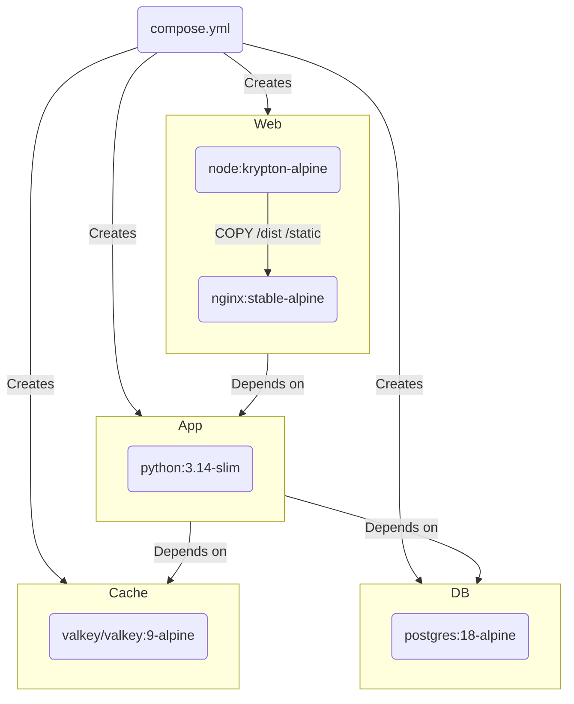
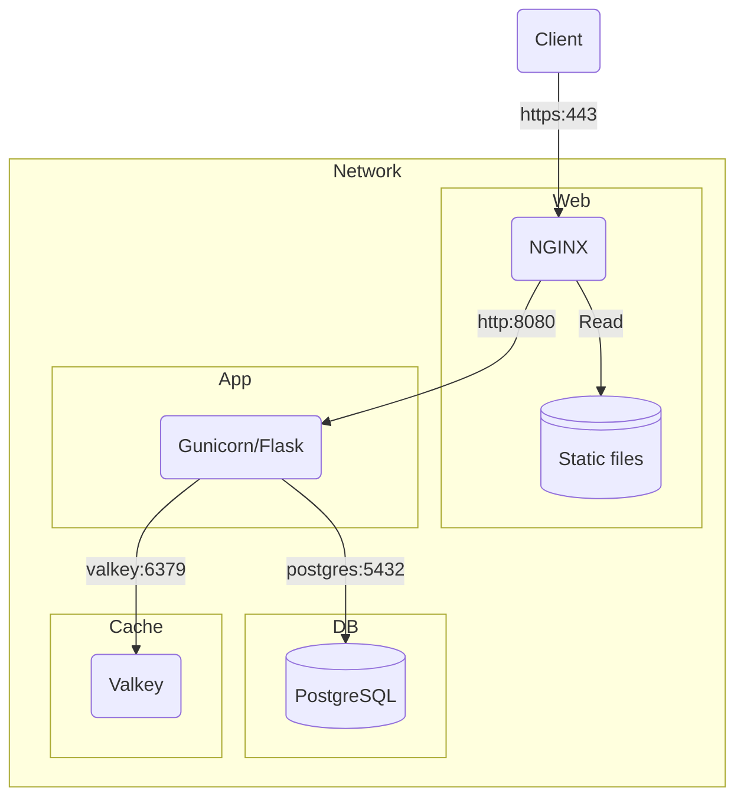
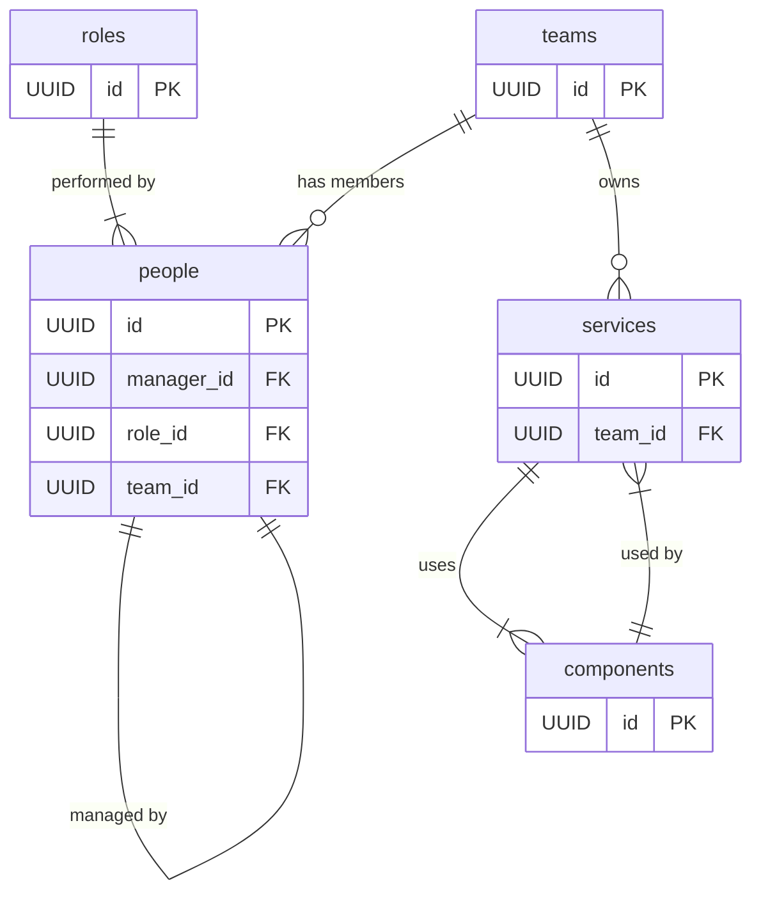

# Conflux

Conflux is an operational knowledge platform that helps organisations understand ownership, responsibility, and dependency across people, teams, services, and components.

As organisations grow, ownership and dependency information often becomes fragmented across spreadsheets, wiki pages, diagrams, ticketing systems, and tribal knowledge.

Over time this leads to:

- unclear ownership
- unsupported services
- duplicated capability
- risky change
- coordination overhead
- operational blind spots

Conflux provides a continuously maintained view of how technology capabilities are organised, who is accountable for them, and how technical dependencies connect the wider estate. Conflux helps teams make safer changes, reduce operational risk, and improve organisational visibility by bringing together organisational structure and technical architecture into a single coherent model.

## Core concepts

Conflux models technology organisations through five connected concepts.

### People

**An individual within the organisation.**

Each person belongs to a team and performs a role. People contribute to services through the work carried out by their team.

### Teams

**A group of people with shared responsibility for delivering and supporting services.**

Teams define the primary organisational boundary for ownership and accountability. A service may be owned by one team or remain unowned.

### Roles

**A defined set of responsibilities assigned to a person.**

Roles describe the function a person performs within the organisation, such as software development, delivery management, architecture etc.

### Services

**A business-facing or user-facing capability delivered through one or more components.**

A service represents the purpose those components collectively fulfil for users or the organisation. Services may depend on multiple components and may be owned by a single team or remain unowned.

### Components

**A deployable or consumable technical unit used to build services.**

Components represent implementation-level building blocks such as APIs, libraries, applications, databases, pipelines, or infrastructure resources. A component may be used by one or more services.

## Requirements

- Docker
- For local Python development: [uv](https://docs.astral.sh/uv/) and Python. uv can install and manage the required Python version.
- For local frontend development: Node.js 24.

## Getting started

### Set up the development environment

The project pins its Python dependencies in `uv.lock` and its required uv version in `pyproject.toml`. From the repository root, sync the locked development environment:

```shell
uv sync --locked --dev
```

Use `uv run --locked` for Python tools and commands so they run in the project environment. For example, generate a secret key with:

```shell
uv run --locked python -c 'import secrets; print(secrets.token_hex())'
```

To update dependencies, change `pyproject.toml` and run `uv lock`; commit the resulting `uv.lock` changes with the manifest. Do not edit `uv.lock` by hand.

### Set local environment variables

Create a `.env` file in the root of the repo and enter your specific config based on this example:

```dotenv
CONTACT_EMAIL=admin@example.com
DOMAIN=example.com
GRADES=AA,AO,EO,HEO,SEO,SEO+,G7,G6,SCS1,SCS2
LOCATIONS=Birkenhead,Coventry,Croydon,Durham,Fylde,Gloucester,Hull,Leicester,Nottingham,Peterborough,Plymouth,Swansea,Telford,Weymouth
PROFESSIONS=Development,Product,Delivery
POSTGRES_DB=mimisbrunnr
POSTGRES_HOST=db
POSTGRES_PASSWORD=smartestmanalive
POSTGRES_PORT=5432
POSTGRES_USER=mimir
SECRET_KEY=<see_below>
VALKEY_HOST=cache
VALKEY_PORT=6379
```

`PROFESSIONS` is an optional comma-separated list of profession names. Values are trimmed and blank entries are ignored; leave it unset or empty when professions are not used.

The Roles page and `GET /api/v1/roles` support an optional `profession` filter. An empty value (the default) includes all roles, including roles without an assigned profession; a non-empty value matches the configured profession exactly. The filter can be combined with the existing status, sort, page, and per-page parameters.

The People page and `GET /api/v1/people` support the same optional `profession` filter, matching people through their assigned role. An empty value (the default) includes people in roles without a profession. It can be combined with status, employment type, sort, page, and per-page parameters.

You **must** set a new `SECRET_KEY`, which is used to securely sign the session cookie and CSRF tokens. It should be a long random `bytes` or `str`. You can use the output of this Python command to generate a new key:

```shell
uv run --locked python -c 'import secrets; print(secrets.token_hex())'
```

### Run containers

```shell
docker compose up --watch
```

You should now have the app running on <https://localhost/>. Accept the browsers security warning due to the self-signed HTTPS certificate to continue.

### Generate and load local demo data

With the containers running and `GRADES` and `LOCATIONS` set in `.env`, generate fictional data and import it into the local Compose database:

```shell
uv run --locked python data/generate.py
./data/load.sh
```

The generator creates linked teams, roles, people, services, components and service-component relationships as CSV files in `data/`. The import replaces existing Conflux data in the Compose database, so it asks for confirmation before proceeding. If an import fails, the transaction is rolled back.

Role grades use the higher grade where the Government Digital and Data Profession Capability Framework lists a range. For levels without a published indicative grade, the generator carries forward the highest grade stated for that role family; trainee business analyst is assigned EO. Ensure `GRADES` includes all generated grades: EO, HEO, SEO, G7 and G6.

## Checks before pushing

Run the checks for the parts of the project you changed. To check all locally buildable parts before pushing to `latest`, run the following commands from the repository root. They correspond to the Python, frontend, and Docker build workflows.

### Python

```shell
uv audit --locked
uv run --locked ruff check .
uv run --locked ruff format --check .
uv run --locked mypy .
uv run --locked pytest --cov=app --cov-report=term-missing --cov-branch
```

Ruff handles linting, import sorting, and formatting; its configured lint rules also include Bandit security checks.

To apply formatting and safe automatic lint fixes before checking:

```shell
uv run --locked ruff check --fix .
uv run --locked ruff format .
```

### Frontend

The frontend workflow uses Node.js 24 and runs these commands from `web/`:

```shell
cd web
npm install
npm run build
cd ..
```

The Docker build also runs the frontend `prebuild` checks for formatting and linting.

### Docker image

Build the same Dockerfile used by the image workflow. This builds the production image locally; it does not publish or sign it.

```shell
docker build --tag conflux:local .
```

GitHub also runs CodeQL analysis on pushes and pull requests targeting `latest`. Dependency review runs on pull requests targeting `latest`. These checks run in GitHub rather than in the local commands above; review their results alongside the Python, frontend, and Docker workflows before merging. A push to `latest` also builds, publishes, and signs the Docker image.

See [CONTRIBUTING.md](CONTRIBUTING.md) for contribution guidance and [AGENTS.md](AGENTS.md) for the equivalent instructions for coding agents.

## Build process

This project uses Docker Compose to provision containers:


```mermaid
flowchart TB
    compose(compose.yml)
    nginx(nginx:stable-alpine)
    node(node:krypton-alpine)
    postgres(postgres:18-alpine)
    python(python:3.14-slim)
    valkey(valkey/valkey:9-alpine)

    compose -- Creates --> App & Cache & Web & DB
    App -- Depends on --> Cache & DB
    Web -- Depends on --> App

    subgraph Web
        direction TB
        node -- COPY /dist /static --> nginx
    end

    subgraph App
        python
    end

    subgraph DB
        postgres
    end

    subgraph Cache
        valkey
    end
```

## Architecture overview


```mermaid
flowchart TB
    valkey(Valkey)
    client(Client)
    nginx(NGINX)
    flask(Gunicorn/Flask)
    static@{ shape: lin-cyl, label: "Static files" }
    db@{ shape: cyl, label: "PostgreSQL" }

    client -- https:443 --> nginx -- http:8080 --> flask -- postgres:5432 --> db
    flask -- valkey:6379 --> valkey

    subgraph Network
        subgraph Web
            nginx -- Read --> static
        end

        subgraph App
            flask
        end

        subgraph DB
            db
        end

        subgraph Cache
            valkey
        end
    end
```

### Web

NGINX Reverse Proxy and Static File Server

- **What:** Acts as the secure HTTPS entry point to the system. It terminates TLS, routes requests to the backend, and serves static files such as the frontend assets.
- **Why:** Separating static and dynamic routing at the proxy layer ensures performance, security, and scalability. NGINX is fast, battle-tested, and easily configurable.

### App

Flask + Gunicorn application server

- **What:** Hosts the business logic and REST API. It processes client requests, talks to the database, and uses the cache to optimise performance.
- **Why:** Flask offers flexibility and simplicity, while Gunicorn handles concurrency. This separation of concerns allows clean, testable architecture.

### DB

PostgreSQL Database

- **What:** Stores all persistent data in a normalised, relational model.
- **Why:** PostgreSQL is reliable, supports rich querying, and integrates well with Flask via ORMs or SQLAlchemy. Using a relational DB supports integrity and consistency in the data model.

### Cache

Valkey Cache

- **What:** Provides fast, in-memory storage for ephemeral data-used for caching, temporary tokens, session data, etc.
- **Why:** Valkey is extremely fast and well-suited for performance-critical features. It decouples the persistence layer from volatile needs.

### Network

Docker Compose Network

- **What:** Defines the network within which all containers communicate securely and predictably.
- **Why:** Docker Compose simplifies multi-service orchestration and local development.

## Logical data model


```mermaid
erDiagram
    roles {
        UUID id PK
    }

    people {
        UUID id PK
        UUID manager_id FK
        UUID role_id FK
        UUID team_id FK
    }

    teams {
        UUID id PK
    }

    services {
        UUID id PK
        UUID team_id FK
    }

    components {
        UUID id PK
    }

    roles ||--|{ people : "performed by"
    teams ||--o{ people : "has members"
    people ||--|| people : "managed by"
    teams ||--o{ services : "owns"
    services ||--|{ components : "uses"
    components ||--|{ services : "used by"
```

## API Endpoints

| Method | Endpoint              | Description                                                                   |
| ------ | --------------------- | ----------------------------------------------------------------------------- |
| `GET`  | `/api/v1/roles`       | Returns a list of roles in the organisation, optionally filtered and sorted.  |
| `GET`  | `/api/v1/roles/{id}`  | Returns detailed information about a specific role.                           |
| `GET`  | `/api/v1/people`      | Returns a list of people in the organisation, optionally filtered and sorted. |
| `GET`  | `/api/v1/people/{id}` | Returns detailed information about a specific person.                         |
| `GET`  | `/api/v1/teams`       | Returns a list of teams in the organisation, optionally filtered and sorted.  |
| `GET`  | `/api/v1/teams/{id}`  | Returns detailed information about a specific team.                           |
